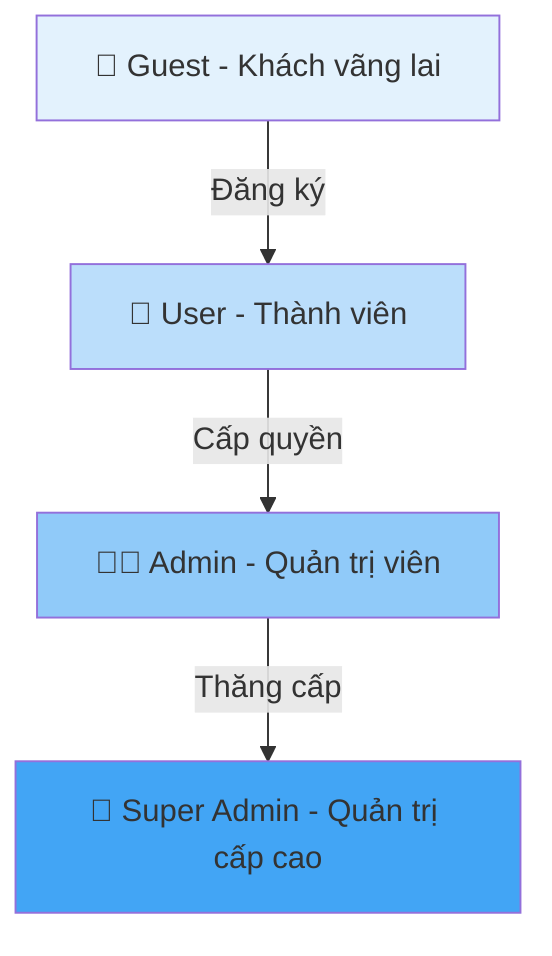
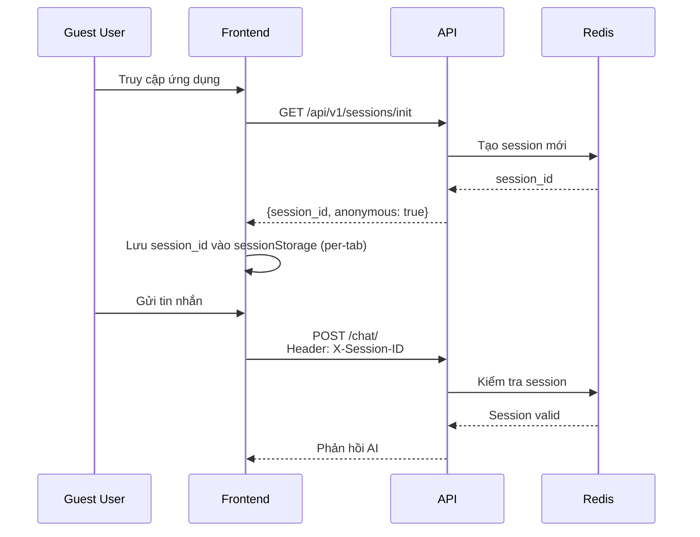
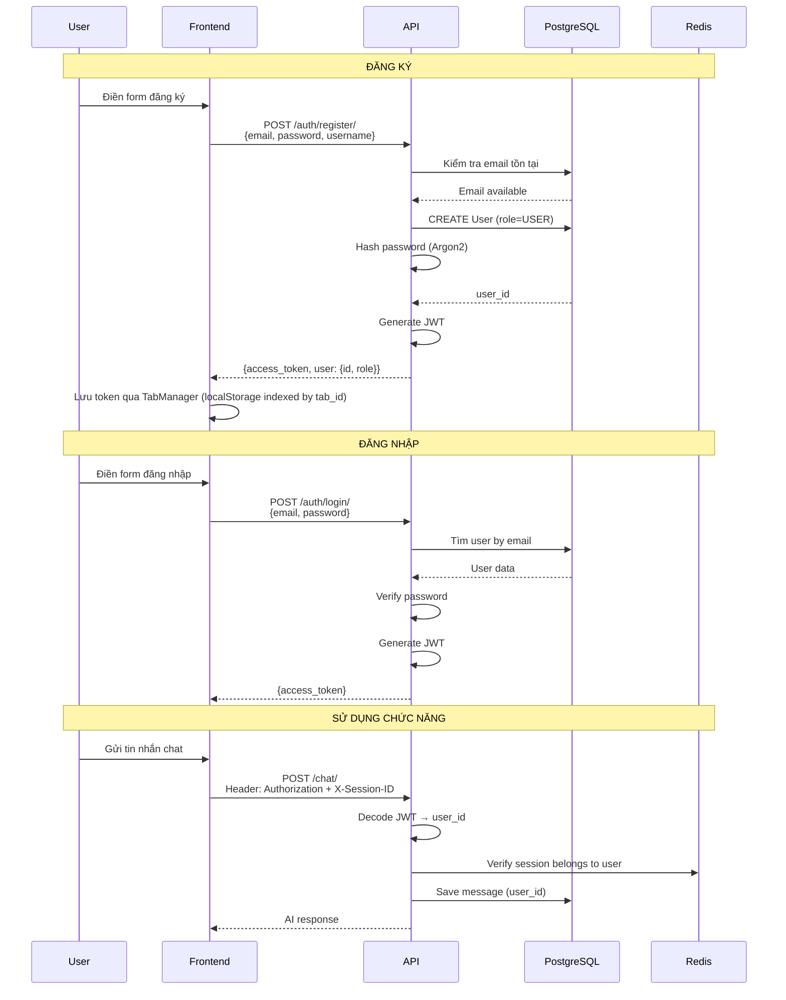
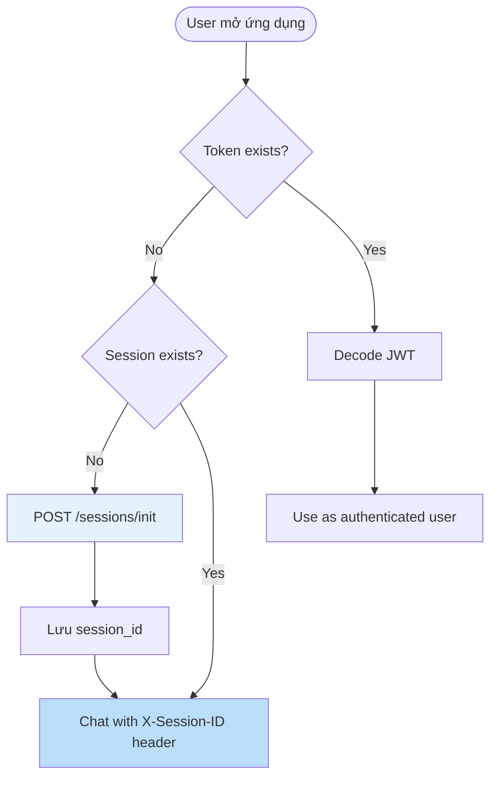
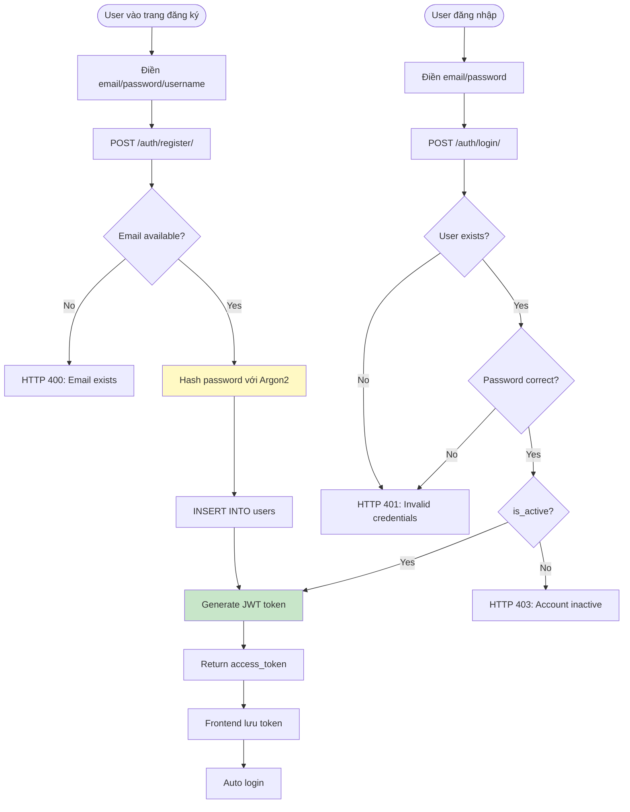
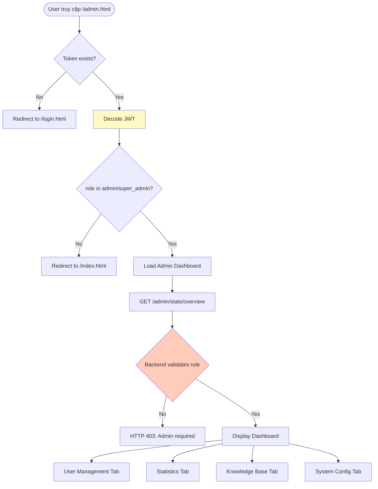
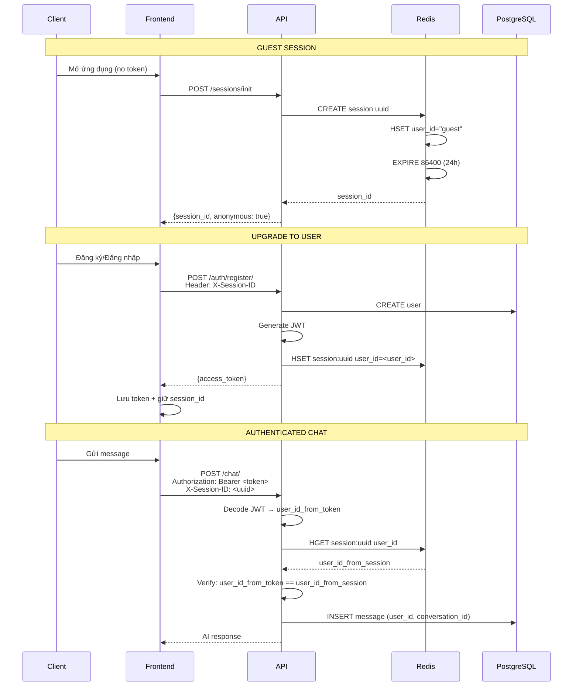

# 🔐 Authorization & Permissions Guide

Tài liệu chi tiết về hệ thống phân quyền (RBAC - Role-Based Access Control) của ứng dụng Chatbot Tư vấn Tâm lý.

## Mục lục

- [Tổng quan Hệ thống Phân quyền](#tổng-quan-hệ-thống-phân-quyền)
- [Chi tiết 4 Loại Phân quyền](#chi-tiết-4-loại-phân-quyền)
- [Ma trận Phân quyền Đầy đủ](#ma-trận-phân-quyền-đầy-đủ)
- [Luồng Xác thực & Phân quyền](#luồng-xác-thực--phân-quyền)
- [API Endpoints theo Phân quyền](#api-endpoints-theo-phân-quyền)

---

## Tổng quan Hệ thống Phân quyền

### Kiến trúc Phân quyền

Hệ thống sử dụng **RBAC (Role-Based Access Control)** với 4 cấp độ người dùng:



### Cơ chế Xác thực

- **JWT (JSON Web Token)**: Sử dụng cho User/Admin/Super Admin
- **Session ID**: Sử dụng cho Guest (Redis-based session)
- **Header Requirements**:
  - `Authorization: Bearer <token>` - JWT cho người dùng đã đăng nhập
  - `X-Session-ID: <uuid>` - Session ID cho tất cả người dùng

---

## Chi tiết 4 Loại Phân quyền

### 1. 👥 GUEST (Khách vãng lai)

**Đặc điểm:**

- Không cần đăng ký/đăng nhập
- Sử dụng tính năng cơ bản ngay lập tức
- Dữ liệu lưu trong Redis session (có thời hạn)
- Session tự động tạo khi truy cập lần đầu

**Quyền hạn:**

✅ **Được phép:**

- Chat với AI chatbot (RAG-enabled)
- Nhận hỗ trợ khủng hoảng (SOS detection)
- Tạo và sử dụng session chat
- Xem lịch sử chat trong session hiện tại

❌ **Không được phép:**

- Lưu lịch sử chat lâu dài (mất khi session hết hạn)
- Theo dõi mood history
- Xuất dữ liệu chat
- Truy cập admin dashboard
- Quản lý tài khoản

**Luồng sử dụng:**



**Hạn chế:**

- Session hết hạn sau 24 giờ không hoạt động
- Không có backup/restore chat
- Không thể xem mood trends

---

### 2. 👤 USER (Thành viên)

**Đặc điểm:**

- Đã đăng ký với email/password
- JWT authentication
- Dữ liệu lưu vĩnh viễn trong PostgreSQL
- Có user_id riêng

**Quyền hạn:**

✅ **Được phép (Tất cả quyền của Guest +):**

- **Lưu trữ lâu dài:** Lịch sử chat không giới hạn thời gian
- **Mood Tracking:** Ghi lại và theo dõi cảm xúc
  - Log mood entry (POST /moods/)
  - Xem mood history (GET /moods/history/)
  - Biểu đồ cảm xúc 7-90 ngày
- **Quản lý Conversation:**
  - List tất cả conversations (GET /conversations/)
  - Update conversation title (PATCH /conversations/{id}/title)
  - Archive conversation (DELETE /conversations/{id}/)
- **Xuất dữ liệu:**
  - Export chat history as JSON (GET /conversations/export)
  - GDPR compliance
- **Quản lý Profile:**
  - Xem thông tin cá nhân (GET /auth/me/)
  - Cập nhật thông tin (trong tương lai)

❌ **Không được phép:**

- Truy cập admin dashboard
- Xem thống kê hệ thống
- Quản lý users khác
- Upload/Delete knowledge base
- Thay đổi system config

**Luồng đăng ký & sử dụng:**



**Database Schema liên quan:**

```sql
-- Users table
CREATE TABLE users (
    id UUID PRIMARY KEY,
    email VARCHAR(255) UNIQUE,
    password_hash VARCHAR(255),
    username VARCHAR(50),
    role VARCHAR(20) DEFAULT 'user',  -- guest, user, admin, super_admin
    is_active BOOLEAN DEFAULT TRUE,
    is_anonymous BOOLEAN DEFAULT FALSE,
    created_at TIMESTAMP,
    updated_at TIMESTAMP
);

-- Conversations (chỉ cho User+)
CREATE TABLE conversations (
    id UUID PRIMARY KEY,
    user_id UUID REFERENCES users(id),  -- NULL for guests
    title VARCHAR(255),
    status VARCHAR(20) DEFAULT 'active',
    created_at TIMESTAMP
);

-- Mood Entries (chỉ cho User+)
CREATE TABLE mood_entries (
    id UUID PRIMARY KEY,
    user_id UUID REFERENCES users(id) NOT NULL,
    mood_value INTEGER CHECK (mood_value BETWEEN 1 AND 5),
    mood_label VARCHAR(50),
    note TEXT,
    created_at TIMESTAMP
);
```

---

### 3. 👨‍💼 ADMIN (Quản trị viên)

**Đặc điểm:**

- Được thăng cấp từ User bởi Super Admin
- JWT có claim `"role": "admin"`
- Truy cập Admin Dashboard
- Quản lý hệ thống ở mức vừa phải

**Quyền hạn:**

✅ **Được phép (Tất cả quyền của User +):**

**1. Thống kê & Analytics (Admin Dashboard):**

- **Overview Stats** (GET /admin/stats/overview):
  - Tổng số users
  - Tổng số conversations
  - Tổng số messages
  - SOS alerts count
  - Active users (7 days)
  - Average messages per conversation
- **Word Cloud** (GET /admin/stats/word-cloud):
  - Top từ khóa người dùng hỏi
  - Phân tích xu hướng chủ đề
- **Mood Trends** (GET /admin/stats/mood-trends):
  - Mood distribution
  - Average mood score
  - Trends theo thời gian

**2. Quản lý Users:**

- **List Users** (GET /admin/users/):
  - Pagination (page, page_size)
  - Search by username/email
  - Filter by role
  - Filter by is_active status
- **Ban User** (POST /admin/users/{user_id}/ban):
  - Set is_active = false
  - Invalidate all user sessions
  - Create audit log
  - ⚠️ Không thể ban Admin/Super Admin
- **Unban User** (POST /admin/users/{user_id}/unban):
  - Reactivate account
  - Create audit log

**3. Knowledge Base Management:**

- **Upload PDF** (POST /admin/knowledge/upload):
  - Upload PDF document
  - Auto-ingest vào ChromaDB
  - Chunking & embedding
  - Set category
- **List PDFs** (GET /admin/knowledge/list):
  - Danh sách tất cả PDFs
  - Metadata (size, upload date)
- **Delete PDF** (DELETE /admin/knowledge/{filename}):
  - Xóa file (⚠️ chunks vẫn còn trong ChromaDB)

**4. System Configuration:**

- **Get Configs** (GET /admin/config/):
  - List all system settings
- **Get Config by Key** (GET /admin/config/{key}):
  - Chi tiết 1 config
- **Update Config** (PUT /admin/config/{key}):
  - `sys_prompt`: System prompt cho AI
  - `sos_keywords`: Danh sách từ khóa khủng hoảng
  - `crisis_hotlines`: JSON array hotlines
  - Validation tự động

❌ **Không được phép:**

- Ban/Delete Admin/Super Admin khác
- Thay đổi role của users
- Xóa audit logs
- Truy cập server infrastructure

**Dependency Protection:**

```python
# src/api/deps.py
async def require_admin(
    current_user: User = Depends(get_current_active_user)
) -> User:
    """Require admin or super_admin role."""
    if current_user.role not in [UserRole.ADMIN, UserRole.SUPER_ADMIN]:
        raise HTTPException(
            status_code=status.HTTP_403_FORBIDDEN,
            detail="Admin privileges required"
        )
    return current_user
```

**Admin Dashboard Route Protection:**

```javascript
// static/js/admin.js
function checkAdminAccess() {
    const token = localStorage.getItem('access_token');
    if (!token) {
        window.location.href = '/login.html';
        return;
    }
    
    // Decode JWT to check role
    const payload = parseJwt(token);
    if (!['admin', 'super_admin'].includes(payload.role)) {
        alert('Access denied: Admin privileges required');
        window.location.href = '/index.html';
        return;
    }
}
```

---

### 4. 👑 SUPER_ADMIN (Quản trị viên cấp cao)

**Đặc điểm:**

- Quyền cao nhất trong hệ thống
- Được tạo thủ công qua script hoặc database
- JWT có claim `"role": "super_admin"`
- Full control over system

**Quyền hạn:**

✅ **Được phép (Tất cả quyền của Admin +):**

- **Quản lý Admin:** ✅ IMPLEMENTED
  - Promote User → Admin: `POST /api/v1/admin/users/{id}/promote`
  - Demote Admin → User: `POST /api/v1/admin/users/{id}/demote`
- **Knowledge Base Maintenance:** ✅ IMPLEMENTED
  - Reset KB: `DELETE /api/v1/admin/knowledge/reset-all`
  - Purge Orphans: `DELETE /api/v1/admin/knowledge/purge-orphans`
- **Audit Log Viewer:** 🔜 NOT YET IMPLEMENTED

> [!NOTE]
> Super Admin có đầy đủ quyền Admin + thêm khả năng quản lý role và bảo trì Knowledge Base.

**Cách tạo Super Admin:**

```bash
# Method 1: Using script
docker exec -it backend python scripts/create_admin.py

# Input:
# Email: superadmin@example.com
# Username: superadmin
# Password: ********
# Role: 2 (Super Admin)

# Method 2: Direct SQL
psql -U postgres -d chatbot_db
UPDATE users SET role = 'super_admin' WHERE email = 'admin@example.com';
```

❌ **Không được phép:**

- Không có hạn chế trong application layer
- Chỉ hạn chế bởi database constraints và business logic

---

## Ma trận Phân quyền Đầy đủ

### Chức năng Core

| Chức năng | Guest | User | Admin | Super Admin |
|-----------|:-----:|:----:|:-----:|:-----------:|
| **Chat với AI** | ✅ | ✅ | ✅ | ✅ |
| **Crisis Support** | ✅ | ✅ | ✅ | ✅ |
| **View chat trong session** | ✅ (tạm thời) | ✅ (vĩnh viễn) | ✅ | ✅ |
| **Lưu lịch sử lâu dài** | ❌ | ✅ | ✅ | ✅ |
| **Mood Tracking** | ❌ | ✅ | ✅ | ✅ |
| **Mood History/Chart** | ❌ | ✅ | ✅ | ✅ |
| **Export Chat History** | ❌ | ✅ | ✅ | ✅ |
| **Archive Conversation** | ❌ | ✅ | ✅ | ✅ |
| **Update Conversation Title** | ❌ | ✅ | ✅ | ✅ |

### Chức năng Admin

| Chức năng | Guest | User | Admin | Super Admin |
|-----------|:-----:|:----:|:-----:|:-----------:|
| **View Dashboard** | ❌ | ❌ | ✅ | ✅ |
| **Overview Statistics** | ❌ | ❌ | ✅ | ✅ |
| **Word Cloud Analytics** | ❌ | ❌ | ✅ | ✅ |
| **Mood Trends** | ❌ | ❌ | ✅ | ✅ |
| **List All Users** | ❌ | ❌ | ✅ | ✅ |
| **Ban User** | ❌ | ❌ | ✅ | ✅ |
| **Unban User** | ❌ | ❌ | ✅ | ✅ |
| **Upload Knowledge PDF** | ❌ | ❌ | ✅ | ✅ |
| **Delete Knowledge PDF** | ❌ | ❌ | ✅ | ✅ |
| **View System Config** | ❌ | ❌ | ✅ | ✅ |
| **Update System Config** | ❌ | ❌ | ✅ | ✅ |
| **Ban/Manage Admin** | ❌ | ❌ | ❌ | ✅ (planned) |
| **View Audit Logs** | ❌ | ❌ | ❌ | ✅ (planned) |

---

## Luồng Xác thực & Phân quyền

### 1. Guest Access Flow



### 2. User Registration & Login Flow



### 3. Admin Access Flow



### 4. Session Management Flow



---

## API Endpoints theo Phân quyền

### Public Endpoints (No Auth Required)

```yaml
Health & Monitoring:
  GET /health: System health check
  # GET /metrics: Removed (ASGI compatibility issue - prometheus-fastapi-instrumentator)
```

### Guest Endpoints (Session ID Only)

```yaml
Session Management:
  POST /api/v1/sessions/init: Tạo session mới cho guest
    Response: {session_id, anonymous: true}

Chat (với X-Session-ID header):
  POST /api/v1/chat/: Gửi tin nhắn
    Body: {content, conversation_id?}
    Response: {message_id, content, role, rag_sources?}
  
  GET /api/v1/chat/history: Xem lịch sử chat
    Query: ?conversation_id=uuid&limit=50&offset=0
    Response: {messages: [...], total, has_more}
```

### User Endpoints (JWT Required)

```yaml
Authentication:
  POST /api/v1/auth/register/: Đăng ký tài khoản
    Body: {email, password, username}
    Response: {access_token, token_type}
  
  POST /api/v1/auth/login/: Đăng nhập
    Body: {email, password}
    Response: {access_token, token_type}
  
  GET /api/v1/auth/me/: Xem thông tin cá nhân
    Response: {id, email, username, role, is_active}

Mood Tracking:
  POST /api/v1/moods/: Log mood entry
    Body: {mood_value: 1-5, mood_label, note}
    Response: {id, mood_value, created_at}
  
  GET /api/v1/moods/history/: Xem mood history
    Query: ?days=7
    Response: [{id, mood_value, note, created_at}, ...]

Conversation Management:
  GET /api/v1/conversations/: List conversations
    Query: ?limit=20&offset=0
    Response: {conversations, total, has_more}
  
  PATCH /api/v1/conversations/{id}/title: Update title
    Auth: X-Session-ID (guest) or JWT (user) - must own conversation
    Body: {title}
    Response: {message: "Title updated successfully"}
  
  DELETE /api/v1/conversations/{id}/: Archive conversation
    Response: 204 No Content
  
  GET /api/v1/conversations/export: Export chat history
    Response: JSON file download
```

### Admin Endpoints (JWT + Admin Role Required)

```yaml
Statistics:
  GET /api/v1/admin/stats/overview: Dashboard overview
    Response: {
      total_users, total_conversations, total_messages,
      sos_alerts, active_users_7d, avg_messages_per_conversation
    }
  
  GET /api/v1/admin/stats/word-cloud: Word cloud data
    Query: ?limit=100
    Response: {words: [{text, value}], total_messages_analyzed}
  
  GET /api/v1/admin/stats/mood-trends: Mood trends
    Query: ?days=30
    Response: {mood_distribution, total_entries, average_mood}

User Management:
  GET /api/v1/admin/users/: List users with pagination
    Query: ?page=1&page_size=20&search=&role=&is_active=
    Response: {users, total, page, page_size, has_more}
  
  POST /api/v1/admin/users/{user_id}/ban: Ban user
    Response: {message, user_id, is_active: false}
    Side Effects: Invalidate sessions, create audit log
  
  POST /api/v1/admin/users/{user_id}/unban: Unban user
    Response: {message, user_id, is_active: true}

Knowledge Base:
  POST /api/v1/admin/knowledge/upload: Upload PDF
    Body: multipart/form-data {file, category}
    Response: {message, filename, chunks, category}
  
  GET /api/v1/admin/knowledge/list: List PDFs
    Response: {files: [{filename, size_mb, uploaded_at}], total}
  
  DELETE /api/v1/admin/knowledge/{filename}: Delete PDF
    Response: {message, filename, warning}

System Configuration:
  GET /api/v1/admin/config/: List all configs
    Response: [{key, value, description}, ...]
  
  GET /api/v1/admin/config/{key}: Get specific config
    Response: {key, value, description}
  
  PUT /api/v1/admin/config/{key}: Update config
    Body: {value}
    Response: {key, value, description}
    Validated keys:
      - sys_prompt: System prompt (50-5000 chars)
      - sos_keywords: Comma-separated (min 3)
      - crisis_hotlines: JSON array [{name, number, available?}]
```

### Super Admin Endpoints (Implemented)

```yaml
User Role Management (✅ IMPLEMENTED):
  POST /api/v1/admin/users/{user_id}/promote: Promote User to Admin
    Authorization: Requires super_admin role
    Response: {message, user_id, role: "admin"}
    Errors: 403 if already admin, 404 if not found

  POST /api/v1/admin/users/{user_id}/demote: Demote Admin to User
    Authorization: Requires super_admin role
    Response: {message, user_id, role: "user"}
    Errors: 403 if super_admin or regular user, 404 if not found

Knowledge Base Maintenance (✅ IMPLEMENTED):
  DELETE /api/v1/admin/knowledge/reset-all: Reset entire KB
    Response: {message, chunks_deleted, cache_cleared}

  DELETE /api/v1/admin/knowledge/purge-orphans: Purge orphaned data
    Response: {message, orphaned_sources, chunks_removed, cache_cleared}

Audit Logs (🔜 NOT YET IMPLEMENTED):
  GET /api/v1/admin/audit-logs/: View all audit logs
    Query: ?page=1&action=&user_id=
```

---

## Security & Best Practices

### 1. Password Security

```python
# Argon2 password hashing (src/core/security.py)
from argon2 import PasswordHasher

ph = PasswordHasher()

def get_password_hash(password: str) -> str:
    """Hash password using Argon2id."""
    return ph.hash(password)

def verify_password(plain_password: str, hashed: str) -> bool:
    """Verify password against Argon2 hash."""
    try:
        ph.verify(hashed, plain_password)
        return True
    except:
        return False
```

### 2. JWT Token Security

```python
# JWT configuration (src/config.py)
SECRET_KEY = os.getenv("SECRET_KEY")  # Must be strong random string
ALGORITHM = "HS256"
ACCESS_TOKEN_EXPIRE_MINUTES = 10080  # 7 days

# Token payload
{
    "sub": "user_id_uuid",
    "role": "user|admin|super_admin",
    "exp": timestamp
}
```

### 3. Session Security

```python
# Redis session structure (actual implementation)
session:uuid = {
    "user_id": "uuid" | "guest",
    "conversation_id": "uuid",
    "created_at": "timestamp"
}

# TTL: 24 hours for GUEST sessions only
# Authenticated user sessions have NO TTL (persist until logout)
```

### 4. Admin Protection

```python
# Cannot ban admin/super_admin (src/api/v1/admin/users.py)
if user.role in [UserRole.ADMIN, UserRole.SUPER_ADMIN]:
    raise HTTPException(
        status_code=403,
        detail="Cannot ban admin users"
    )
```

### 5. CORS & Security Headers

```nginx
# nginx.conf
add_header X-Content-Type-Options "nosniff";
add_header X-Frame-Options "DENY";
add_header X-XSS-Protection "1; mode=block";
add_header Strict-Transport-Security "max-age=31536000; includeSubDomains" always;
```

---

## Troubleshooting

### Issue 1: 403 Forbidden on Admin Endpoint

**Nguyên nhân:**

- Token không có claim `role: admin/super_admin`
- Token expired
- User account is banned (is_active = false)

**Giải pháp:**

```javascript
// Kiểm tra role trong token
const token = localStorage.getItem('access_token');
const payload = JSON.parse(atob(token.split('.')[1]));
console.log('User role:', payload.role);

// Nếu role = 'user', cần được promote lên admin
```

### Issue 2: Session Expired for Guest

**Nguyên nhân:**

- Redis session TTL = 24 hours
- Session bị xóa sau khi không hoạt động

**Giải pháp:**

```javascript
// Tự động tạo session mới khi hết hạn
async function ensureSession() {
    const sessionId = localStorage.getItem('session_id');
    if (!sessionId) {
        const response = await fetch('/api/v1/sessions/init', {
            method: 'POST'
        });
        const data = await response.json();
        localStorage.setItem('session_id', data.session_id);
    }
}
```

### Issue 3: Cannot Upload PDF

**Nguyên nhân:**

- Không có quyền admin
- File không phải PDF
- File quá lớn (Nginx limit)

**Giải pháp:**

```bash
# Tăng upload limit trong nginx.conf
client_max_body_size 50M;

# Reload nginx
docker exec nginx nginx -s reload
```

---

## Changelog

| Version | Date | Changes |
|---------|------|---------|
| 1.0 | 2025-12-18 | Initial comprehensive authorization guide |
|     |            | - Documented all 4 roles (Guest, User, Admin, Super Admin) |
|     |            | - Complete permission matrix |
|     |            | - Authentication flows |
|     |            | - Full API endpoint mapping |

---

## References

- [API Design](./API_DESIGN.md) - Detailed API specifications
- [Database Schema](./DATABASE_SCHEMA.md) - Database structure
- [User Flow](./USER_FLOW.md) - User journey diagrams
- [Feature List](./FEATURE_LIST.md) - Complete feature checklist
