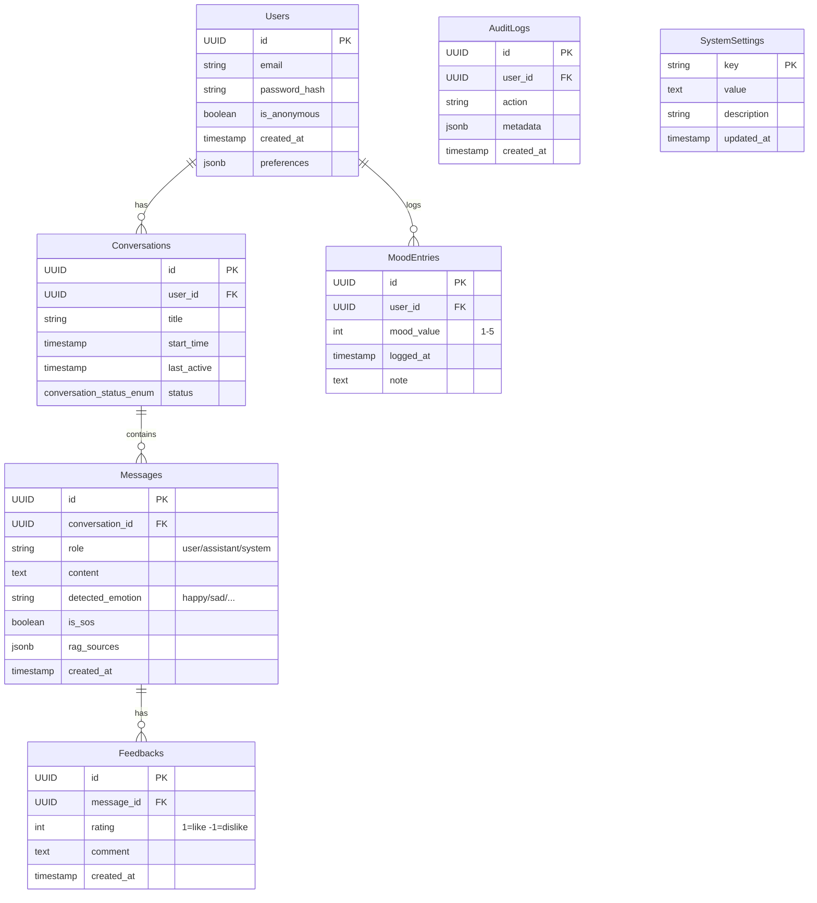

# 🗄️ Database Schema Design

Thiết kế cơ sở dữ liệu cho Chatbot Tâm lý (PostgreSQL recommended).

> [!NOTE]
> **Phân quyền (RBAC)**: Hệ thống sử dụng Role-Based Access Control với 4 cấp độ (👥 Guest, 👤 User, 👨‍💼 Admin, 👑 Super Admin).
>
> **Chi tiết đầy đủ**: Xem [AUTHORIZATION_GUIDE.md](./AUTHORIZATION_GUIDE.md)

## 1. Entity Relationship Diagram (ERD) Overview



## 2. Table Details

### 2.1 Users (Người dùng) - RBAC Core Table

Lưu trữ thông tin người dùng. Hỗ trợ cả người dùng đăng ký và khách (anonymous).

| Column | Type | Description |
|--------|------|-------------|
| `id` | UUID | Primary Key |
| `username` | VARCHAR(50) | Tên hiển thị (hoặc biệt danh) |
| `email` | VARCHAR(255) | Nullable (cho anonymous user) |
| `password_hash` | VARCHAR(255) | Argon2id hash (nullable cho guest/anonymous) |
| `role` | role_enum | `guest` (default), `user`, `admin`, `super_admin` |
| `is_anonymous` | BOOLEAN | `true` nếu là khách |
| `is_active` | BOOLEAN | `true` (default), `false` nếu bị ban (deactivated) |
| `created_at` | TIMESTAMP | Thời gian tạo |
| `updated_at` | TIMESTAMP | Thời gian cập nhật lần cuối |

**Enum:** `role_enum = ('guest', 'user', 'admin', 'super_admin')`

**Role Permissions Overview:**

- **👥 Guest**:
  - `is_anonymous = true`
  - `email = NULL`, `password_hash = NULL`
  - Chỉ có session-based access (Redis)
  - Không lưu dữ liệu vĩnh viễn vào `conversations`, `mood_entries`
  
- **👤 User**:
  - `is_anonymous = false`
  - Email/Password required
  - JWT authentication
  - Access: Chat, Mood Tracking, Export Data
  
- **👨‍💼 Admin**:
  - Promoted from User (manual process)
  - Access: Admin Dashboard, Statistics, User Management, Knowledge Base, System Config
  - Cannot ban other admins
  
- **👑 Super Admin**:
  - Highest privileges
  - Created via script or manual database update
  - (Future) Role Management, Audit Log Viewer

**Constraints:**

- `email` must be UNIQUE when NOT NULL
- `password_hash` required for `role != 'guest'`
- `is_active` can be set to `false` by Admin (ban user)

### 2.2 MoodEntries (Nhật ký cảm xúc)

Lưu vết trạng thái cảm xúc theo thời gian phục vụ tính năng Mood Tracker.

| Column | Type | Description |
|--------|------|-------------|
| `id` | UUID | Primary Key |
| `user_id` | UUID | Foreign Key → Users.id |
| `mood_value` | INT | Thang 1-5 (1: Tệ, 5: Tuyệt vời) |
| `mood_label` | VARCHAR(50) | Angry, Sad, Neutral, Happy, Excited |
| `note` | TEXT | Ghi chú ngắn của user (optional) |
| `created_at` | TIMESTAMP | Thời điểm log |

### 2.3 Conversations (Cuộc hội thoại)

Một cuộc hội thoại (conversation) chứa nhiều tin nhắn (messages).

| Column | Type | Description |
|--------|------|-------------|
| `id` | UUID | Primary Key |
| `user_id` | UUID | Foreign Key → Users.id (nullable for guest) |
| `title` | VARCHAR(255) | Tiêu đề tự động hoặc user đặt |
| `status` | conversation_status_enum | `active`, `archived` |
| `created_at` | TIMESTAMP | Thời gian bắt đầu |
| `updated_at` | TIMESTAMP | Thời gian hoạt động gần nhất |

**Enum:** `conversation_status_enum = ('active', 'archived', 'ended')`

### 2.4 Messages (Tin nhắn)

Lưu trữ tất cả tin nhắn trong hệ thống.

| Column | Type | Description |
|--------|------|-------------|
| `id` | UUID | Primary Key |
| `conversation_id` | UUID | Foreign Key → Conversations.id |
| `role` | message_role_enum | `user`, `assistant`, `system` |
| `content` | TEXT | Nội dung tin nhắn |
| `detected_emotion` | VARCHAR(50) | Cảm xúc phát hiện (nullable) |
| `is_sos` | BOOLEAN | `true` nếu phát hiện SOS/crisis |
| `rag_sources` | JSONB | Nguồn tham khảo từ RAG (nullable) |
| `created_at` | TIMESTAMP | Thời điểm gửi |

**Enum:** `message_role_enum = ('user', 'assistant', 'system')`

**rag_sources Format:**

```json
[
  {
    "title": "Sổ tay sơ cứu tâm lý",
    "page": 12,
    "content_snippet": "excerpt..."
  }
]
```

> **Note**: `score` field is NOT stored in database, only used during retrieval.

### 2.5 Feedbacks (Phản hồi)

Feedback của user về chất lượng câu trả lời của bot.

| Column | Type | Description |
|--------|------|-------------|
| `id` | UUID | Primary Key |
| `message_id` | UUID | Foreign Key → Messages.id |
| `rating` | INT | 1 = Like (positive), -1 = Dislike (negative) |
| `comment` | TEXT | Góp ý chi tiết (nullable) |
| `created_at` | TIMESTAMP | Thời điểm feedback |

### 2.6 SystemSettings (Cài đặt hệ thống)

Lưu trữ cấu hình động của hệ thống.

| Column | Type | Description |
|--------|------|-------------|
| `key` | VARCHAR(50) | Primary Key (unique key name) |
| `value` | TEXT | Giá trị cấu hình (JSON hoặc plain text) |
| `description` | TEXT | Mô tả cấu hình |
| `updated_at` | TIMESTAMP | Lần cập nhật gần nhất |

**Examples:**

- `sys_prompt`: System prompt cho LLM
- `sos_keywords`: Từ khóa SOS/crisis (comma-separated string)
- `crisis_hotlines`: Đường dây nóng (JSON array as string)

### 2.7 AuditLogs (Nhật ký Audit) **[Sprint 3]**

Lưu trữ các hành động quan trọng của admin và user cho mục đích kiểm toán.

| Column | Type | Description |
|--------|------|-------------|
| `id` | UUID | Primary Key |
| `user_id` | UUID | Foreign Key → Users.id (nullable for system actions) |
| `action` | VARCHAR(100) | Loại hành động: `USER_BANNED`, `USER_UNBANNED`, `CONFIG_UPDATED`, etc. |
| `ip_address` | VARCHAR(50) | Địa chỉ IP thực hiện hành động (nullable) |
| `user_agent` | TEXT | User Agent string từ browser/client (nullable) |
| `metadata` | JSONB | **[Sprint 3]** Context data bổ sung (nullable) |
| `created_at` | TIMESTAMP | Thời điểm ghi log (indexed) |

**Metadata Examples:**

User Ban:

```json
{
  "banned_user_id": "550e8400-e29b-41d4-a716-446655440000",
  "reason": "spam_activity"
}
```

Config Update:

```json
{
  "key": "sos_keywords",
  "old_value": "[\"chết\", \"tự tử\"]",
  "new_value": "[\"chết\", \"tự tử\", \"kết thúc\"]"
}
```

**Indexes:**

- `idx_audit_user_id` on `user_id`
- `idx_audit_action` on `action`
- `idx_audit_created_at` on `created_at` (for time-based queries)

---

## 3. Indexes \u0026 Performance

### Critical Indexes

```sql
-- Users
CREATE INDEX idx_users_email ON users(email);
CREATE INDEX idx_users_role ON users(role);
CREATE INDEX idx_users_is_active ON users(is_active);

-- Conversations
CREATE INDEX idx_conv_user_id ON conversations(user_id);
CREATE INDEX idx_conv_status ON conversations(status);
CREATE INDEX idx_conv_updated_at ON conversations(updated_at DESC);

-- Messages
CREATE INDEX idx_msg_conv_id ON messages(conversation_id);
CREATE INDEX idx_msg_role ON messages(role);
CREATE INDEX idx_msg_is_sos ON messages(is_sos) WHERE is_sos = true;
CREATE INDEX idx_msg_created_at ON messages(created_at DESC);

-- MoodEntries
CREATE INDEX idx_mood_user_id ON mood_entries(user_id);
CREATE INDEX idx_mood_created_at ON mood_entries(created_at DESC);

-- Feedbacks
CREATE INDEX idx_feedback_msg_id ON feedbacks(message_id);

-- AuditLogs (Sprint 3)
CREATE INDEX idx_audit_user_id ON audit_logs(user_id);
CREATE INDEX idx_audit_action ON audit_logs(action);
CREATE INDEX idx_audit_created_at ON audit_logs(created_at DESC);
```

---

## 4. Data Migration (Sprint 3)

### Add Metadata Column to AuditLogs

```sql
-- Add metadata column (Sprint 3 update)
ALTER TABLE audit_logs 
ADD COLUMN metadata JSONB NULL;

-- Verify column added
SELECT column_name, data_type, is_nullable
FROM information_schema.columns 
WHERE table_name = 'audit_logs' 
  AND column_name = 'metadata';
```

---

## 5. Security Considerations

1. **Password Hashing**: Use Argon2id (implemented in `src/core/security.py`)
2. **UUID**: Use UUID v4 for all primary keys
3. **Soft Delete**: Conversations use `status='archived'` instead of DELETE
4. **Audit Trail**: All admin actions logged in `audit_logs` table
5. **PII Protection**: Anonymous users have nullable `email` and `user_id`

---

**Last Updated:** 2025-12-25 (Documentation Audit)  
**Schema Version:** 4.0  
**Migration Required:** None (schema unchanged)
