# 🏗️ System Architecture

**Kiến trúc tổng thể của hệ thống Chatbot Tư vấn Tâm lý.**
Architecture Style: **Modular Monolith** wrapped in **Docker Containers**.

```mermaid
graph TD
    User[Web Browser / Mobile] -->|HTTPS/443| Nginx[Nginx Reverse Proxy]
    
    subgraph "Docker Compose Network"
        Nginx -->|Proxy Pass :8000| API[FastAPI Backend - Python]
        Nginx -->|Serve Static| Frontend[Static Files - HTML/JS]
        
        API -->|Read/Write| DB[(PostgreSQL Main DB)]
        API -->|Vector Search| Chroma[(ChromaDB Vector Store)]
        API -->|Cache/Session| Redis[(Redis Cache)]
        
        API -->|Inference| LLM[Google Gemini API]
        note right of LLM: Fallback: 2.0-flash-exp -> flash-latest -> 1.5-flash
    end
```

---

## 1. Component Overview

### 1.1 Frontend Layer (Presentation)

- **Tech Stack**: Vanilla HTML5, JavaScript (ES6+), TailwindCSS.
- **Responsibility**: UI rendering, User Input, Mood Tracking visualization.
- **Communication**: REST API calls to Nginx.
- **State Management**: `AppState` class (Session, User, Mood).

### 1.2 Gateway Layer (Nginx)

- **Role**: Entry point, Reverse Proxy, Static File Server, SSL Termination.
- **Configuration**:
  - Port 80/443 exposed.
  - CORS header handling (backup).
  - Rate Limiting (`limit_req_zone`).

### 1.3 Backend Layer (Application Logic)

- **Tech Stack**: Python 3.11, FastAPI, SQLAlchemy, Pydantic.
- **Modules**:
  - `auth`: JWT handling, Register/Login.
  - `chat`: RAG logic, Prompt engineering, Crisis detection.
  - `rag`: RAG Service with **Model Fallback Mechanism** (Gemini 2.0 -> Flash -> 1.5).
  - `mood`: Mood logging & analytics.
- **Dependencies**:
  - `uvicorn`: ASGI Server.
  - `langchain`: RAG pipeline utils.

### 1.4 Data Layer (Persistence)

- **PostgreSQL**: Users, Conversations, Messages, MoodEntries, SystemSettings.
- **ChromaDB**: Embeddings storage for RAG (Knowledge base).
- **Redis**: Session storage, Caching (optional).

---

## 2. RAG Pipeline Architecture

```mermaid
sequenceDiagram
    participant U as User
    participant A as API
    participant V as VectorDB
    participant L as LLM
    
    U->>A: Send Message ("Tôi buồn quá")
    A->>A: Crisis Detection (Regex/Keywords)
    
    alt is Crisis
        A->>U: Urgent Response + Hotlines
    else is Normal
        A->>V: Similarity Search ("buồn")
        V-->>A: Context Documents
        A->>L: Prompt + Context + History
        L-->>A: AI Response
        A->>U: Final Answer
    end
```



---

## 3. Database Schema Relation

See [DATABASE_SCHEMA.md](./DATABASE_SCHEMA.md) for full ERD.

- **Tables**: `users`, `conversations`, `messages`, `mood_entries`, `feedback`.
- **Optimization**: Indexes on `user_id`, `created_at` for faster history retrieval.

---

## 4. Scalability & Optimization

### 4.1 Stateless Backend

- Backend services are stateless.
- Session data stored in **Redis** (not in-memory).
- Allows horizontal scaling (Spin up multiple API containers).

### 4.2 Caching Strategy ✅ (2025-12-22)

- **Static Assets**: Cached by Nginx & Browser (Cache-Control).
- **Semantic Cache**: Redis-based cache for RAG query results (TTL: 1 hour).
  - Key: SHA256 hash of query embedding.
  - Value: Response + Sources.
  - Location: `src/core/semantic_cache.py`
- **BM25 Index Cache**: In-memory cache for BM25 index (TTL: 5 minutes).
  - Avoids rebuilding index on every query.
  - Auto-invalidated on document upload/delete.
  - Location: `src/services/rag_service.py`
- **SOS Keywords Cache**: In-memory cache (TTL: 5 minutes).
  - Reduces DB queries for crisis detection.
  - Location: `src/core/safety.py`
- **Query Embedding Reuse**: Generate once, pass to hybrid_search.
  - Saves ~100-300ms per request.

### 4.3 Connection Pooling ✅

- **PostgreSQL**: SQLAlchemy QueuePool (pool_size=5, max_overflow=10).
- **ChromaDB**: Singleton client with periodic heartbeat (60s interval).
  - Location: `src/core/vector_store.py`
- **Redis**: Single async connection, init at startup.

### 4.4 Session Isolation Strategy

**Redis Key Structure**: `session:{session_id}`

- **TTL**: 24 hours (Guest sessions only).
- **Data**: Stores `user_id`, `created_at`, `last_activity`.
- **Isolation**: Each browser tab uses `sessionStorage` for separate session_id.
- **Multi-tab**: JWT token shared via `localStorage`, but chat sessions are per-tab.

---

## 5. Security Layer

### 5.1 API Security

- **Authentication**: OAuth2 Password Bearer (JWT).
- **Password Hashing**: Argon2id.
- **Input Validation**: Pydantic Schemas (Strict typing).
- **SQL Injection**: Prevented by ORM.

### 5.1.1 SSL/TLS Configuration (Production) ✅

**Transport Security:**

- **Protocols**: TLSv1.2, TLSv1.3 only (TLSv1.0/1.1 disabled).
- **Cipher Suites**: Modern ECDHE-ECDSA/RSA-AES256-GCM-SHA384 suites.
- **HSTS**: `max-age=31536000; includeSubDomains` (Force HTTPS for 1 year).
- **HTTP → HTTPS**: 301 Permanent Redirect.
- **Certificate**: Let's Encrypt (Automated via `ssl_setup.sh`).

**Nginx SSL Configuration Snippet:**

```nginx
server {
    listen 443 ssl http2;
    ssl_protocols TLSv1.2 TLSv1.3;
    ssl_ciphers 'ECDHE-ECDSA-AES128-GCM-SHA256:...';
    add_header Strict-Transport-Security "max-age=31536000" always;
}
```

**Security Benefits:**

- ✅ **Confidentiality**: Encrypts data in transit.
- ✅ **Integrity**: Prevents tampering.
- ✅ **Trust**: Validated identity via CA.

### 5.2 Application Security

- **Crisis Safety**: Hardcoded fallback for crisis keywords.
- **System Prompt Protection**: Hidden instructions in LLM context.
- **Rate Limiting**: 10 req/s per IP (Nginx layer).

---

## 6. Directory Structure

```text
/
├── docker-compose.yml
├── nginx/
│   └── nginx.conf
├── src/
│   ├── api/
│   │   └── v1/
│   ├── core/
│   ├── db/
│   ├── models/
│   ├── schemas/
│   └── services/
├── static/     # Frontend
└── tests/
```
