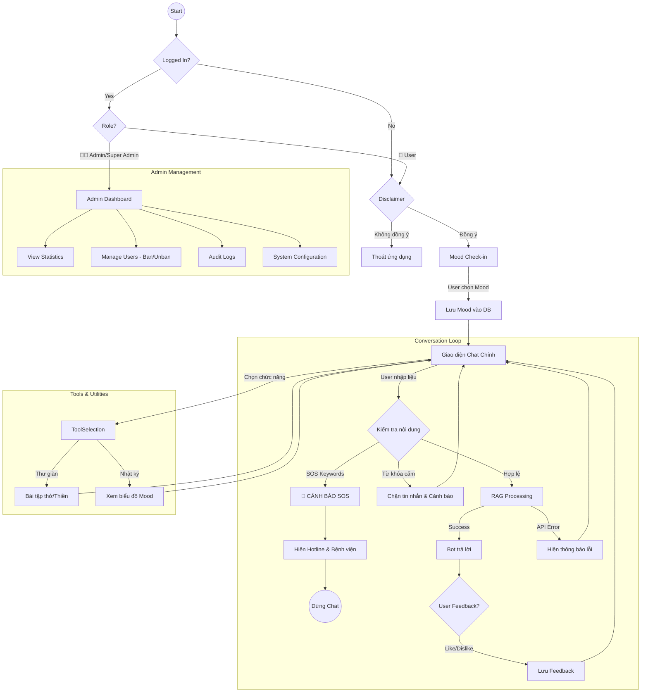

# 🔄 User Flow Diagram

Mô tả luồng trải nghiệm người dùng (User Journey) chuẩn cho Chatbot Tâm lý.

> [!NOTE]
> **Hệ thống Phân quyền (RBAC)**: Hỗ trợ 4 cấp độ - 👥 Guest, 👤 User, 👨‍💼 Admin, 👑 Super Admin
>
> **Chi tiết đầy đủ**: [AUTHORIZATION_GUIDE.md](./AUTHORIZATION_GUIDE.md) - Ma trận phân quyền và luồng xác thực

## Giải thích chi tiết các bước

1. **Onboarding (Start -> MainChat)**:
    * Người dùng mở app.
    * **Bắt buộc**: Phải xem và đồng ý với Tuyên bố miễn trách nhiệm (Disclaimer).
    * **Start**: Vào giao diện Chat chính, nhận lời chào từ Bot (Mood Check-in được tích hợp tùy chọn).

2. **Safety Loop (SOS Check)**:
    * Mọi tin nhắn user gửi (`InputCheck`) đều phải đi qua bộ lọc An toàn trước tiên.
    * Nếu phát hiện từ khóa nguy hiểm -> **Ngắt ngay lập tức**, chuyển sang màn hình Cấp cứu (CrisisAlert).

3. **Conversation RAG Loop**:
    * Nếu an toàn, tin nhắn đi qua RAG Pipeline.
    * Bot trả lời kèm empathy (thấu cảm) và citation (trích dẫn).
    * User có thể đánh giá câu trả lời.

4. **Utility Navigation**:
    * Từ màn hình chính, user có thể rẽ nhánh sang các công cụ hỗ trợ (Bài tập, Lịch sử) mà không cần chat liên tục.
